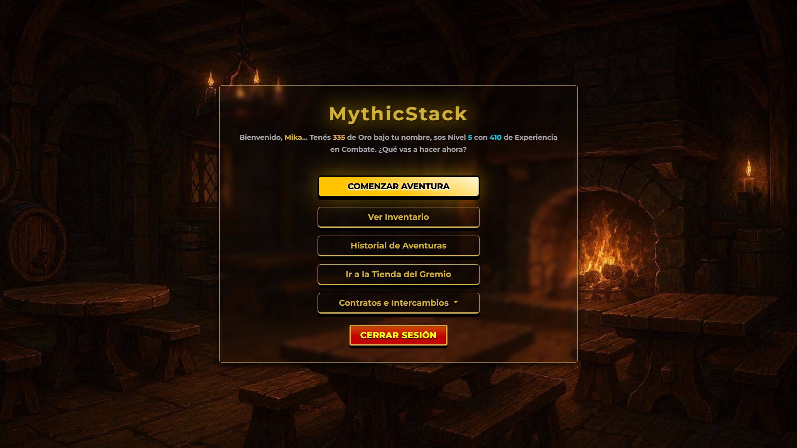
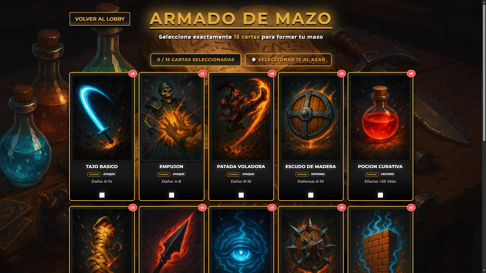
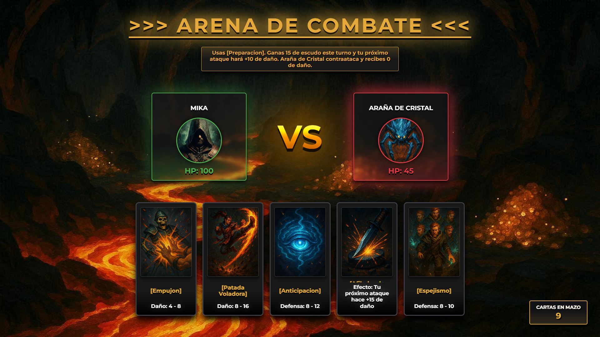
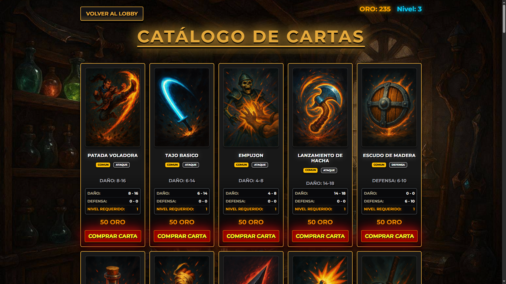
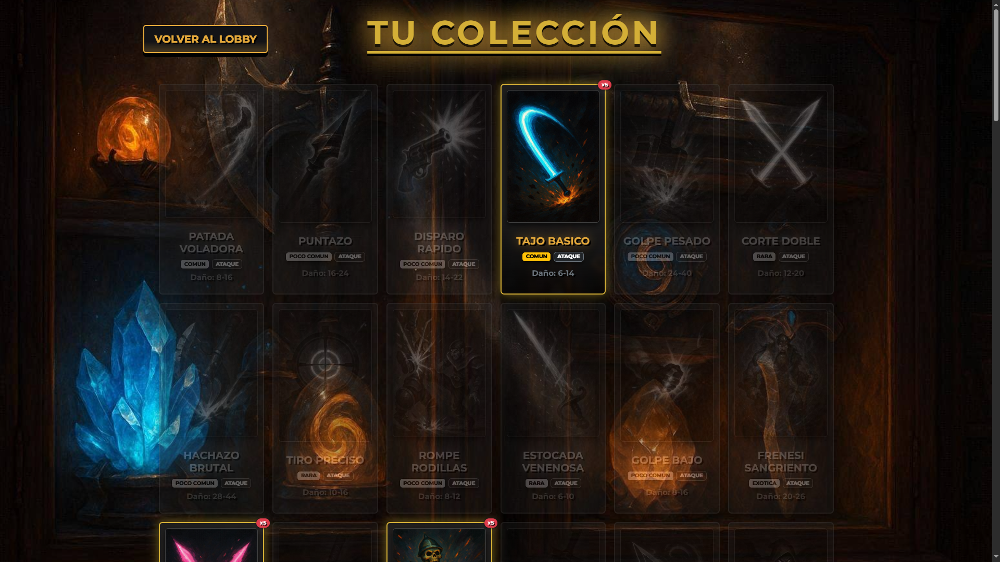

  <h1>🃏 MythicStack. 🃏</h1>

  

  
Proyecto final de la materia <strong>Taller Web 1</strong>.

  

     MythicStack es un juego de cartas por turnos donde el jugador debe construir un mazo, enfrentarse a distintos enemigos y progresar obteniendo oro y experiencia para desbloquear nuevas
     cartas.
  

   
   
  <h2>✨ CARACTERÍSTICAS: </h2>
  

    🔐 Sistema de autenticación. 
    🏠 Lobby principal. 
    ⚔️ Sistema de combate por turnos. 
    🃏 Construcción y gestión de mazos. 
    🎒 Inventario de cartas. 
    🛒 Tienda con compra de cartas. 
    🔄 Sistema de intercambio de cartas. 
    📜 Historial de partidas. 
    ⭐ Sistema de experiencia y niveles. 
    💰 Economía basada en oro.
  

   

  <h2>🎮 MÉCANICA DEL JUEGO: </h2>
  

    1. 🔐 Iniciar sesión. 
    2. 🏠 Acceder al lobby. 
    3. 🃏 Seleccionar un mazo. 
    4. 🌲 Explorar uno de los bosques disponibles. 
    5. ⚔️ Enfrentarse a un enemigo utilizando cartas. 
    6. 💰 Obtener oro y experiencia al ganar. 
    7. 🛒 Comprar nuevas cartas en la tienda. 
    8. 📈 Mejorar el mazo para futuras partidas.
  

   

  <h2>📚 TECNOLOGÍAS UTILIZADAS: </h2>

  ### Backend:
  
  
  
  
  

  ### Frontend:
  
  
  
  

  ### Bases de datos y servidor:
  
  

  ### Herramientas:
  
  
  
  
  

    

  

  <h2>📸 IMÁGENES DEL JUEGO: 📸</h2>
  

   

  <h2>👥 INTEGRANTES: </h2>
  

    <a href="https://github.com/NahuelRn" target="_blank">NahuelRn</a> 
    <a href="https://github.com/CarolinaMagnetti" target="_blank">CarolinaMagnetti</a> 
    <a href="https://github.com/Mikaaaaaaaaaaaaaaaaaaaaaaaaa" target="_blank">Mikaaaaaaaaaaaaaaaaaaaaaaaaa</a> 
  

   

  <h2>📄 LICENCIA: </h2>
  
Proyecto desarrollado con fines académicos para la materia <strong>Taller Web 1</strong>.

